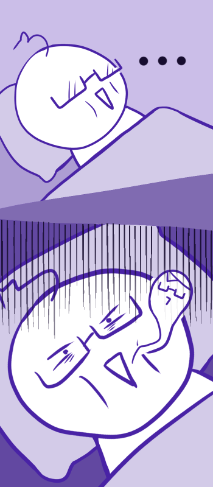

# Sleepy 
*Currently in development*

**Please do not attempt to use this at this point in development.**

Ever had a hard time sleeping? Me too. Playing music or sounds of rain in the background usually helps
me go to sleep. 

The thing is, sometimes I wake up in the middle of the night to turn the music back off.
Well, Sleepy can turn it off for you by itself! It reduces the music after some interval of time until 
it completely mutes the music. 

Currently, this only works for music played in Chrome. This is great if you have some pre-made
sleeping playlist!

It's pretty simple. Well, that's all for now. Thank you for reading!
